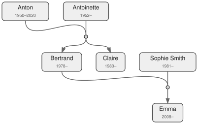

# family-tree
Using a simple domain specific language ([DSL](https://en.wikipedia.org/wiki/Domain_specific_language)), the _family-tree_ python script parses `.family` files into a [_GraphViz_](https://graphviz.org/) DOT file, then renders the family tree as an [SVG](https://en.wikipedia.org/wiki/SVG) graphic.



## Overview
The _family-tree_ domain specific language (DSL) supports 3 concepts:

- Persons (with optional birth and death years)
- Marriages
- Children

## Prerequisites

- [_Python_](https://www.python.org/downloads/) installed
- [_GraphViz_](https://graphviz.org/)  installed

```console
sudo apt install python3
sudo apt install graphviz
```

## Usage
Example input (from `./examples/example.family`):

```text
# Persons
Anton (1950-2020)
Antoinette (1952-)

Bertrand (1978)
Claire (1980)

Sophie_Smith (1981)

Emma (2008-)

# Marriages
Anton + Antoinette
Bertrand + Sophie_Smith

# Children
Bertrand <- Anton, Antoinette
Claire    <- Anton, Antoinette
Emma       <- Bertrand, Sophie_Smith
```

Building the tree:

```console
./produce.sh ./examples/example.family
```


### Limitations
Compared to fully fleged family tree software like [_Gramps_](https://gramps-project.org/) or others that support the more complex [GEDCOM](https://en.wikipedia.org/wiki/GEDCOM) format, the _family-tree_ script aims for simplicity.
